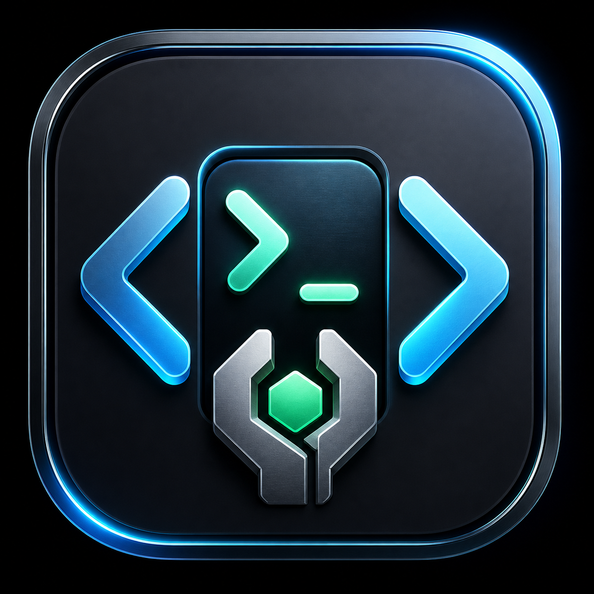
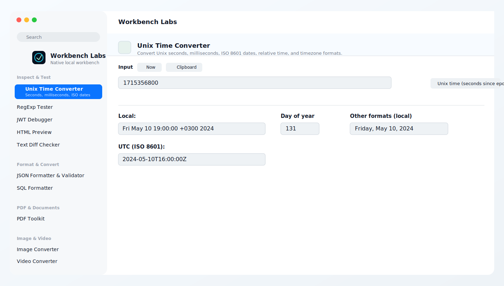
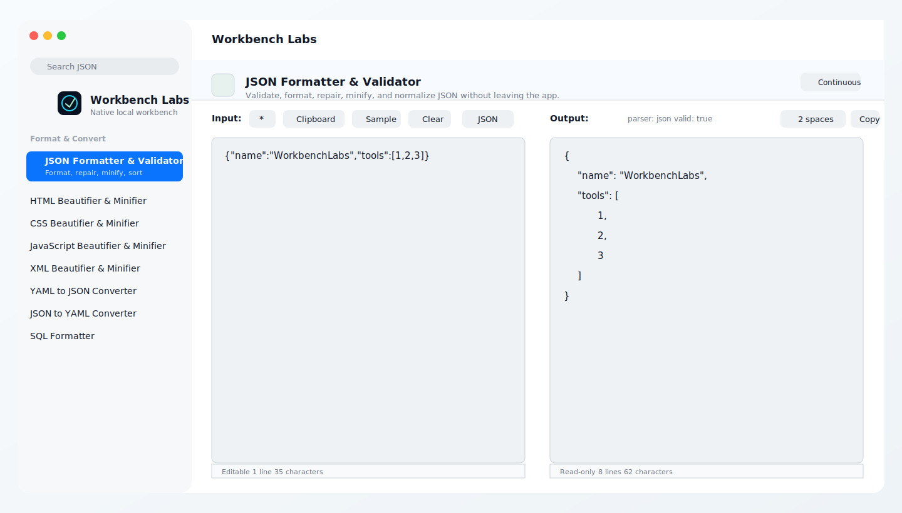
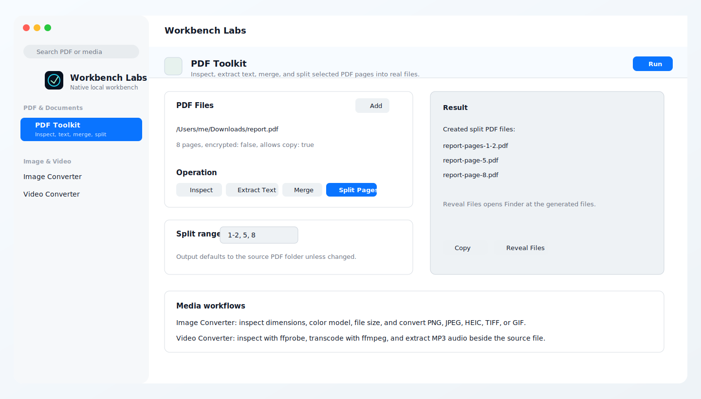

<p align="center">
  
</p>

# Workbench Labs

Workbench Labs is an open-source native macOS developer utility workbench. It is local-first, built with SwiftUI and Swift Package Manager, and designed to bring everyday developer transforms, inspectors, file tools, and media/PDF utilities into one offline app.

## Highlights

- Native macOS app for macOS 14+
- Searchable tool sidebar, clipboard inspection, menu bar access, and macOS Services integration
- Swift-native tools for timestamps, Base64, URL/query parsing, hashes, UUIDs, QR codes, PDF page editing, multilingual PDF OCR, image conversion, image metadata scrubbing, video conversion, and more
- Bundled JavaScript runtime for mature formatters and converters such as JSON, HTML, CSS, JavaScript, XML, YAML, SQL, Markdown, diff, and HTML/SVG to JSX
- Local file workflows for PDF split/merge/page editing, metadata scrubbing, image conversion, batch image resizing, image GPS removal, and video/audio extraction
- No hosted service requirement for normal tool execution

## Screenshots







## Included Tool Areas

- Inspect/Test: Unix time, regular expressions, JWTs, HTML preview, Markdown preview, text diff, string inspection, secret scanning
- Format/Convert: JSON, HTML, CSS, JavaScript, XML, YAML/JSON, SQL, number bases, string case, HTML/SVG to JSX
- Developer: JSON Schema validation with local AJV plus .env inspection, comparison, and redaction
- Encode/Decode: URL, Base64, query strings, HTML entities, backslash escaping
- Generate/Crypto: UUID/ULID-style UUID workflows, Lorem Ipsum, QR code, hash generation
- PDF & Documents: inspect PDFs, extract selectable text, scrub PDF metadata, OCR scanned PDFs locally in English and Hebrew, merge PDFs, split selected pages, extract page ranges into one PDF, delete pages, reorder pages, rotate pages, and append pages from other PDFs
- Image & Video: inspect/convert images, batch resize/compress images, inspect/scrub image metadata and GPS location, trim/transcode video, extract MP3/WAV/AAC audio, and generate thumbnails

See every tool and workflow in the [complete feature guide](docs/FEATURES.md).

## Roadmap at a Glance

Planned future builds include certificate inspection, SQLite browsing, HTTP request tooling, cURL import/export, OpenAPI exploration, archive inspection, cron expression explanation, and dependency lockfile inspection.

See the full future roadmap in [docs/FEATURE_ROADMAP.md](docs/FEATURE_ROADMAP.md).

## Change Tracking

User-facing tool releases are tracked in [CHANGELOG.md](CHANGELOG.md).

## Agentic Roadmap Workflow

The repository includes a human-gated GitHub Actions workflow for building roadmap features on separate branches. Each roadmap item gets a `feature/<id>` branch, a draft integration PR, and a GitHub issue. Agent work targets the feature branch; promotion to `main` happens only after a local macOS app review and explicit approval.

See [docs/AGENTIC_DEVELOPMENT.md](docs/AGENTIC_DEVELOPMENT.md) for the full loop.

## Brand Assets

The app logo and icon are available in [docs/assets/brand](docs/assets/brand).

## Install

### One-Command Release Install

This downloads the latest GitHub Release, copies `WorkbenchLabs.app` to `/Applications`, verifies the bundle, and opens it:

```sh
curl -fsSL https://raw.githubusercontent.com/markes76/workbench-labs/main/script/install_release.sh | bash
```

### Source Install

This builds the app, copies it to `/Applications/WorkbenchLabs.app`, verifies the bundle, and opens it:

```sh
git clone https://github.com/markes76/workbench-labs.git
cd workbench-labs
./script/install.sh
```

You can also double-click:

```text
Install Workbench Labs.command
```

### Build Without Installing

```sh
npm install
./script/build_and_run.sh --build
open dist/WorkbenchLabs.app
```

### Create a Release Zip

```sh
./script/package_release.sh
```

The zip is written to `dist/WorkbenchLabs-macos.zip` by default. Set `ZIP_BASENAME=...` to override the filename.

## Requirements

- macOS 14 or newer
- Xcode command line tools or a compatible Swift 6 toolchain
- Node.js and npm for rebuilding the bundled formatter runtime
- Optional: `tesseract` and `tesseract-lang` for Hebrew PDF OCR
- Optional: `ffmpeg` and `ffprobe` for video conversion, WebM/GIF output, and MP3 extraction

Install optional OCR and video tooling with Homebrew:

```sh
brew install tesseract tesseract-lang
brew install ffmpeg
```

## Development

```sh
npm install
npm run build:runtime
swift build
swift test
npm run test:runtime
npm audit --omit=dev
```

Run and verify the app bundle:

```sh
./script/build_and_run.sh --verify
```

Install the local build:

```sh
./script/install.sh
```

## Distribution Notes

The current app is locally signed for developer distribution. It is not notarized yet, so downloaded builds may require the usual macOS security confirmation. A Developer ID signed and notarized release flow is planned before broad non-developer distribution.

## License

Workbench Labs is open source under the [MIT License](LICENSE).
